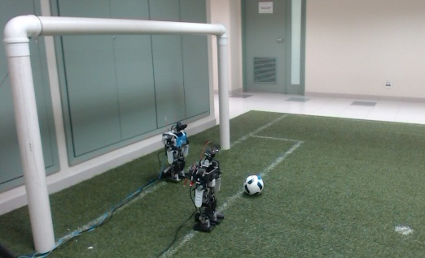

[](https://travis-ci.org/Isaac25silva/Goalkeeper-DNN)

# Goalkeeper-DNN


[](https://youtu.be/b3tebN9dwN8)

### Setup

Compile the code of the robot running *./setup.sh* in Goalkeeper-DNN directory.

### OS and dependencies.

This program was tested in Ubuntu 14.04 LTS 64 bits

* Main Dependencies:
    * cmake
    * g++
    * python 2.7 
    * python-numpy
    * python-opencv
    * [Caffe](https://github.com/NVIDIA/caffe) 

 
 
 ### Downloads
 
 * Downloads:
    * DNNs trained are available in [link-Networks](https://feiedu-my.sharepoint.com/personal/isaacjesus_fei_edu_br/_layouts/15/guestaccess.aspx?folderid=054e36743516745db8ab64e9c61b71467&authkey=ASlbVagsc7eXeiq4_do7w0w)
 
    * Datasets are available in [link-Dataset](https://feiedu-my.sharepoint.com/personal/isaacjesus_fei_edu_br/_layouts/15/guestaccess.aspx?folderid=0b9239488b2ab4025954c97835f9b22ba&authkey=AZH1KhME-IMzkzpiU2othmg)
    
 
 
  ### Running the test
  
 
 Use the scripts decisionDNN.py to test the DNN and run the control process to receive the decision.
 
 * Running the decision.py:
 
```shell
      cd Vision/src/
      python decisionDNN.py ./nets/dataset_googlenet.tar.gz --ws
```
 
 * Running the control process:
 
```shell
      ./build/Control/control --p
```

  ### EXPERIMENTS
  
  * DNN accuracy and spend time to classify an image on an [Intel NUC]( http://www.intel.com/content/www/us/en/nuc/overview.html) Core i5-4250U, 8GB SDRAM, 120GB SDD.

Network      | Input     | Accuracy | Mean Time[s]  | \sigma  |
-------------|:---------:|:--------:|:-------------:|:-------:|
Conv4        | 110x110   | 87.86    | 0.093         | 0.00602    
Alexnet      | 110x110   | 88.00    | 0.131         | 0.00811    
Conv4        | 256x256   | 91.57    | 0.458         | 0.02784    
Alexnet      | 256x256   | 91.57    | 0.470         | 0.01591    
GoogLeNet    | 256x256   | 92.86    | 0.682         | 0.03386    

